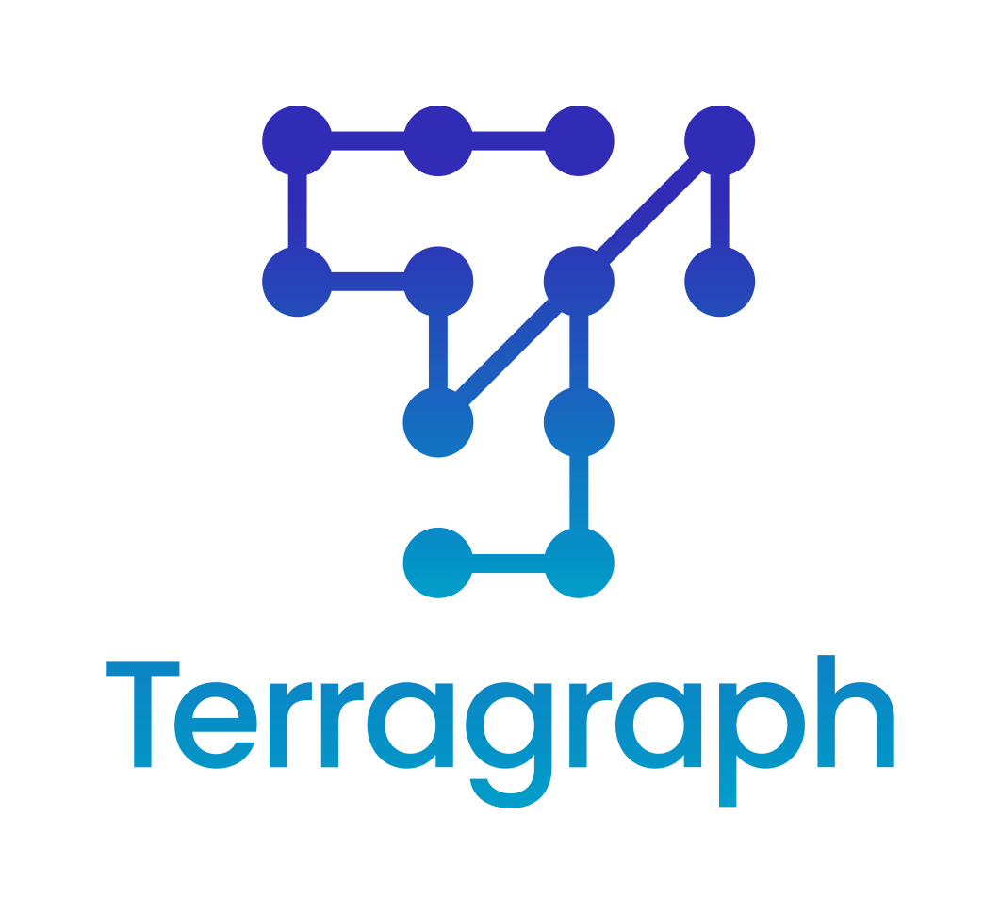

# Terragraph Planner

  

Terragraph is a gigabit wireless technology designed to meet the growing demand
for reliable high-speed internet access. Documentation for the project can be
found at [terragraph.com](https://terragraph.com).

This repository contains a Python library developed for operators to plan
and optimize a mesh network using Terragraph's 60 GHz mmWave technology.

## Get Started
See the [Quick Start](docs/runbook/Quick_Start.md) guide for code setup
instructions. Full documentation for the Terragraph Planner can be found
[here](http://terragraph.github.io/terragraph-planner).

## Community
Please review our [Code of Conduct](CODE_OF_CONDUCT.md) and
[Contributing Guidelines](CONTRIBUTING.md).

General discussions are held on our
[Discord server](https://discord.gg/HQaxCevzus).

## License
Terragraph Planner has an MIT-style license as can be seen in the
[LICENSE](LICENSE) file.
